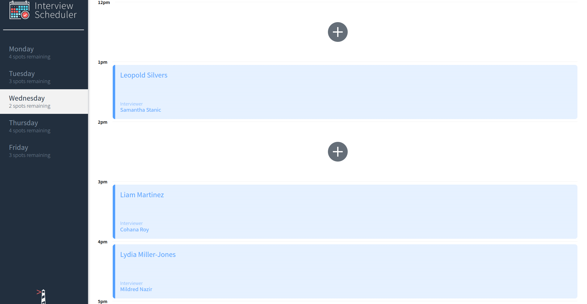
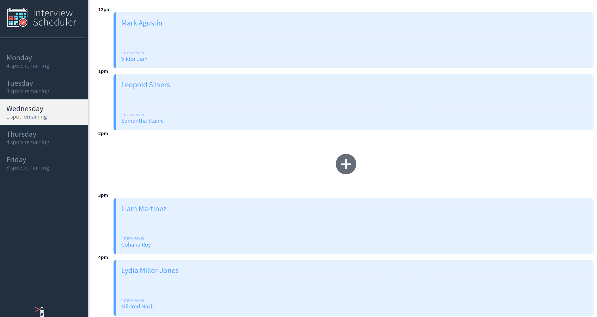
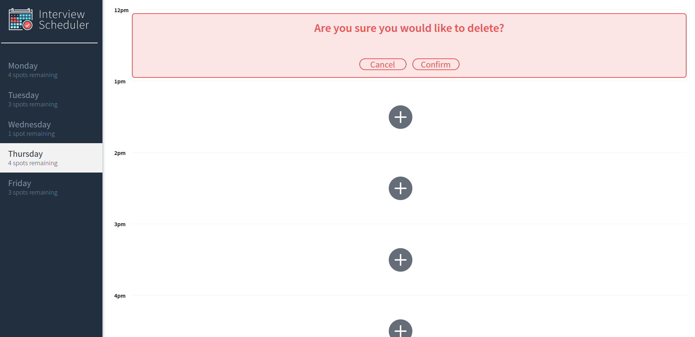
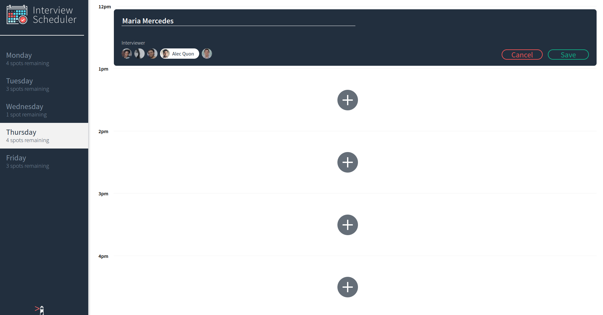
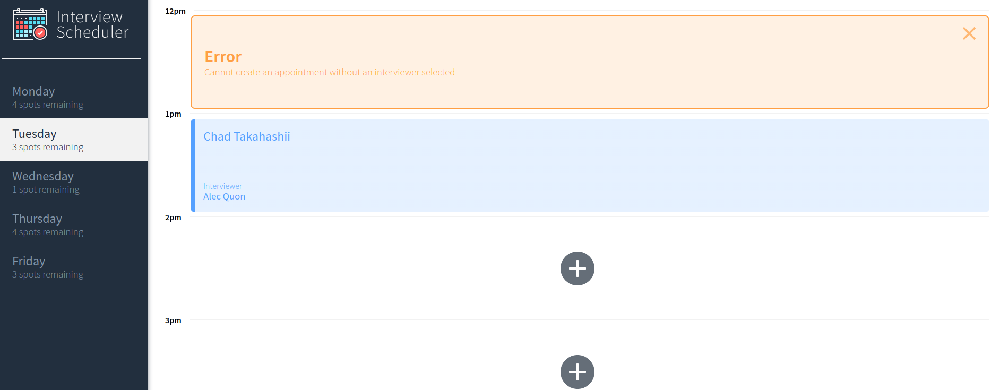

# Interview Scheduler

### A single page application built with React. With this application, a user can create, edit and delete interview appointments. Postgress is used as database. The visual design, static html and CSS is provided. Components are built in isolation using Storybook. The webpack-dev-server provides a live environment that updates the the browser when a file is saved. Jest is used to implement a few features using test driven development.

## Setup

### Install dependencies with `npm install`.

### Dependencies:

- axios: ^0.26.0
- classnames: ^2.2.6
- normalize.css: ^8.0.1
- react: ^16.9.0
- react-dom: ^16.9.0
- @testing-library/react-hooks: ^7.0.2
- react-test-renderer: ^16.9.0

## Running Webpack Development Server

```sh
npm start
```

## Running Jest Test Framework

```sh
npm test
```

## Running Storybook Visual Testbed

```sh
npm run storybook
```

## Final Product











